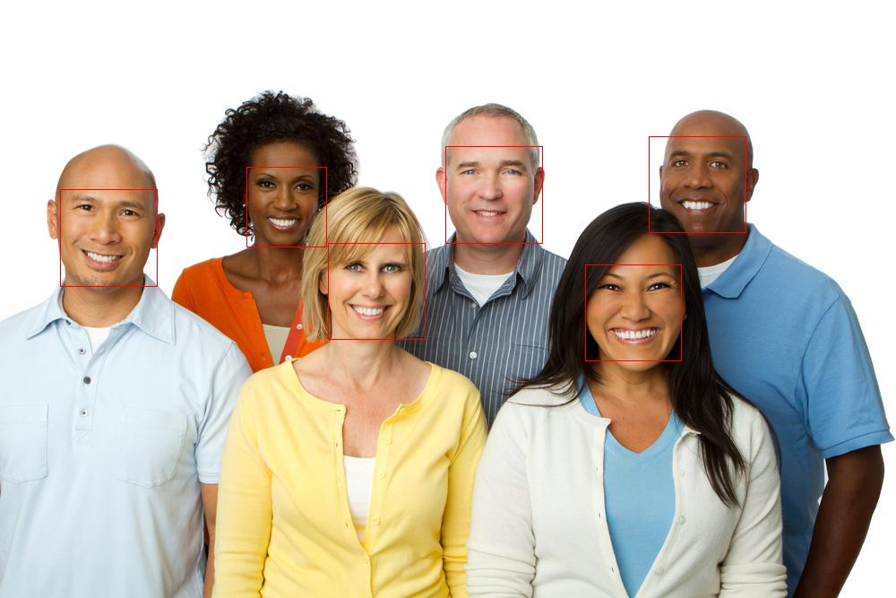

The Face recognition files are built during the learning process in LinkedIn. Each file is put in different folder and output images are saved.

### Face Detection: 
A sample picture is taken and used the built-in function of python to detect the faces in the picture. The output of detected face can be found here 

### Face Landmarks:
For the given image facial features are extracted from the picture using the built in function. The output of facial features detected in an image can be found here

### Face Recognition: 
A set of images can be found in the folder Face Recognition along with code files. Three images staring with name person are passed as known images. One the of the other images which are unknown is passed to recognize the face using the built-in function of python.

There is another file which is written to fine tune the facial features for less pixeled image to detect the face.
