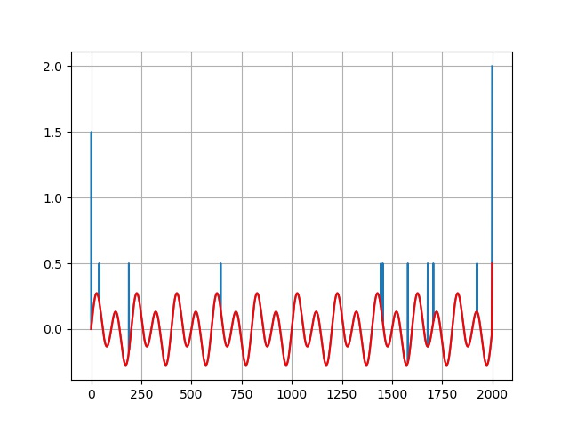

Python function is implemented based on the MATLAB function implemented by Giovan. The repository for the MATLAB can be found here:

[Matlab code](https://github.com/gberrante/MatlabFunctions.git)

SpikeRemoval function removes spikes that go over the threshold value "mu"  each array element that is over mu is averaged between previous and subsequent element. If the spikes occur in the first or last element of the array, it filters it using the nearest value.

SpikeRemove.py contains the code for Spike removal.

Test_SpikeRemoval.py contains the test code for the implemented function.

The output of the test code can be found below:

