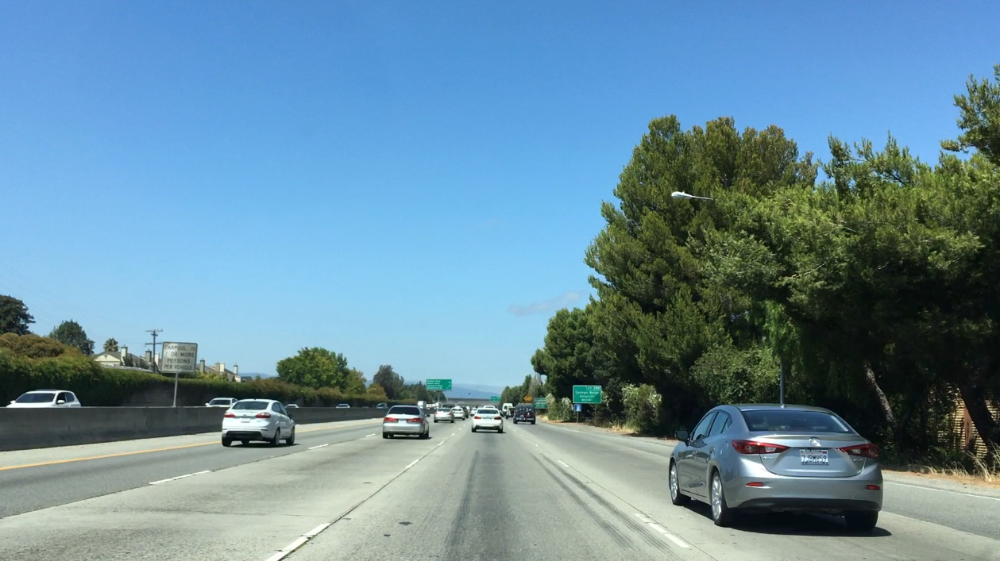
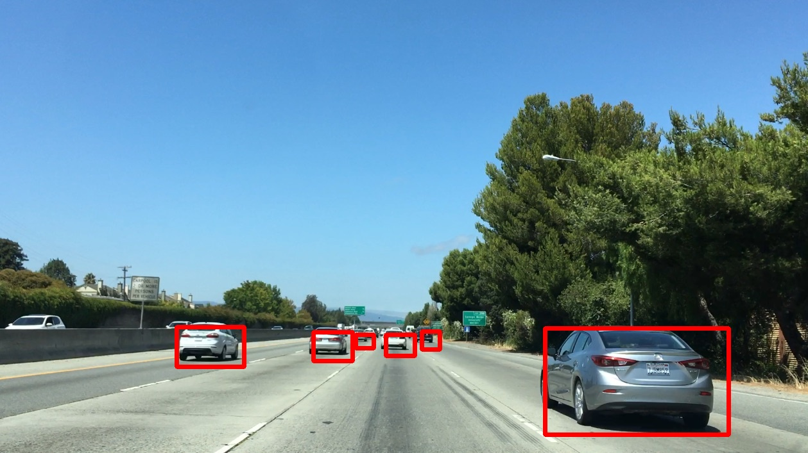

In this code, a function takes image as an argument and a list of bounding box coordinates for each car. Function draws the bounding boxes on a copy of the image and return that as its output. This is implemented manually using OpenCV function.

The image is taken from one of the Udacity Course

The input of the image for the function can be found here

After drawing the bounding boxes manually using co-ordinates, the output looks like the below image:
